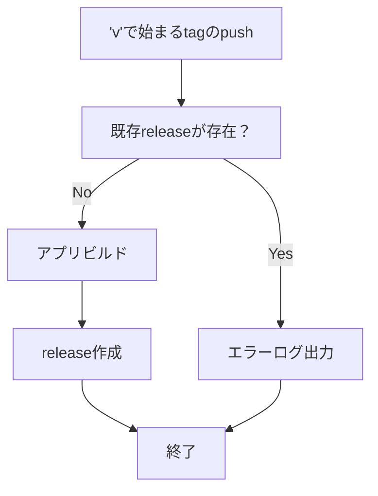

# リポジトリ概要

タグがpushされたらreleaseを作るGitHub Actionsのサンプル

# GitHub Actions フロー

```mermaid
flowchart TD
  start["'v'で始まるtagのpush"] --> releaseCheck["既存releaseが存在？"];
  %% 既存releaseが存在しないとき
  releaseCheck -- No --> build["アプリビルド"];
  build --> createRelease["release作成"] --> fin;

  %% 既存releaseが存在するとき
  releaseCheck -- Yes --> log["エラーログ出力"] --> fin["終了"];
```